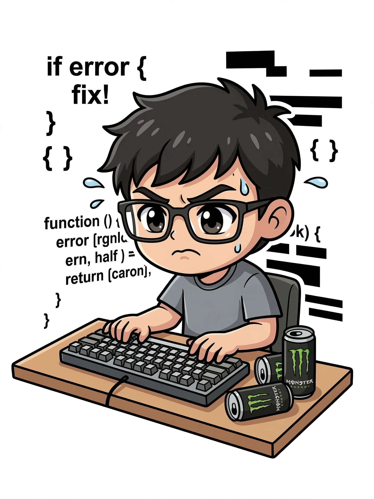

# 👋 Felipe Marin

<!-- Banner animado con nombre -->


<!-- Imagen del desarrollador -->

  <p align="center">
    <td></td>
    <td></td>
  </p>


<!-- Insignias de visitas y seguidores -->
<p align="center">
  
  
</p>

---

## 🧑‍💻 Sobre mí

```javascript
const dev = {
  nombre:       "Felipe Marin",
  rol:          "Full Stack Developer (en progreso 🔥)",
  estudios:     "Programación de Software",
  ubicación:    "Colombia 🇨🇴",
  mentalidad:   "Aprender · Construir · Mejorar",
  disponible:   true, // abierto a prácticas y proyectos
};
```

- 🎓 Estudiante de **Programación de Software**
- 🌱 Actualmente aprendiendo **Node.js, Express y arquitecturas REST**
- 💡 Me apasiona construir soluciones web desde el frontend hasta la base de datos
- 🤝 Abierto a colaborar en proyectos de práctica y open source

---

## 🛠️ Stack Tecnológico

<div align="center">

### Frontend


### Backend


### Base de Datos


### Herramientas


</div>

---

## 📊 Estadísticas de GitHub

<div align="center">
  
  
</div>

<div align="center">
  
</div>

---

## 📈 Actividad

<div align="center">
  
</div>

---

## 🌐 Conéctate conmigo

<div align="center">

[](https://linkedin.com/in/TU_USUARIO_LINKEDIN)
[](https://github.com/felipemarinmt-cmd)
[](mailto:felipemarinmt@gmail.com)

</div>

---

<div align="center">

<!-- Footer animado -->


*"El código que escribes hoy es la base del desarrollador que serás mañana."*

</div>
